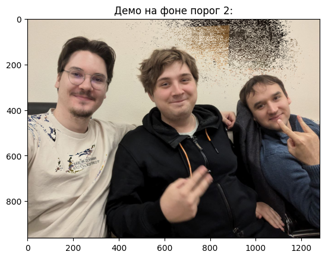
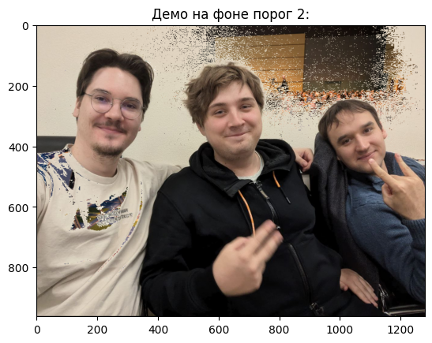
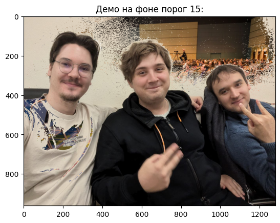
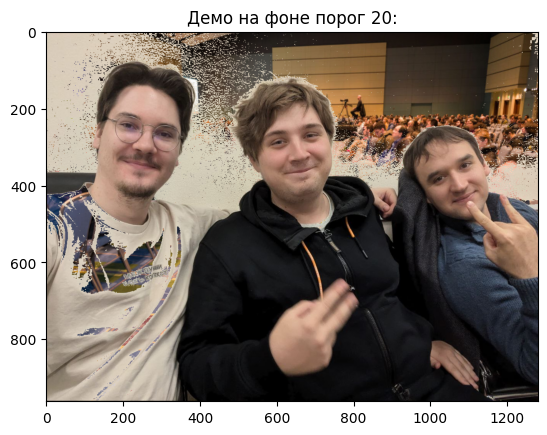
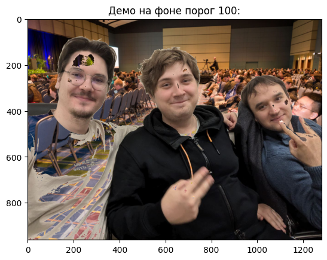

# Лабораторная 1: Chroma key
## Теоретическая база
Chroma key (хромакей, «зелёный экран») — технология совмещения двух или более изображений или видеопотоков, основанная на замене определённого цвета (обычно зелёного или синего) на другое изображение. Метод широко используется в кинематографе, телевидении и компьютерной графике.

Математическая основа:
Каждый пиксель изображения представлен в цветовом пространстве.
Для определения близости цвета используется евклидово расстояние между векторами цвета пикселя и целевого цвета:

$$\sqrt{(B_1-B_2)^2 + (G_1-G_2)^2 + (R_1-R_2)^2}$$

Если расстояние меньше заданного порога, пиксель считается принадлежащим фону и заменяется.

 

## Описание разработанной системы
### Нативно
1. Загрузка изображений:
- Исходное изображение с объектом на фоне определённого цвета.
- Фоновое изображение для замены.
  
2. Приведение размеров:
- Фоновое изображение масштабируется под размер исходного.

3. Построчная обработка пикселей:
- Для каждого пикселя исходного изображения вычисляется евклидово расстояние до целевого цвета.
- Если расстояние меньше порога, пиксель заменяется соответствующим пикселем фона.

 

### OpenCV
1. Проверка совпадения размеров
2. Подготовка целевого цвета
3. Вычисление цветовой разницы
4. Создание маски замены
5. Применение маски

## Результаты работы

  

## Результаты тестирования

  

## Выводы
В ходе лабораторной работы успешно реализована и исследована технология хромакея с использованием двух подходов: нативной реализации на Python и реализации с использованием библиотеки OpenCV. Оба метода продемонстрировали работоспособность и способность корректно заменять заданный цветовой диапазон.  

Реализация на OpenCV показала существенное преимущество в производительности.

## Использованные источники
1. OpenCV Documentation  
https://docs.opencv.org
2. Math Module Python Documentation  
https://docs.python.org/3/library/math.html
